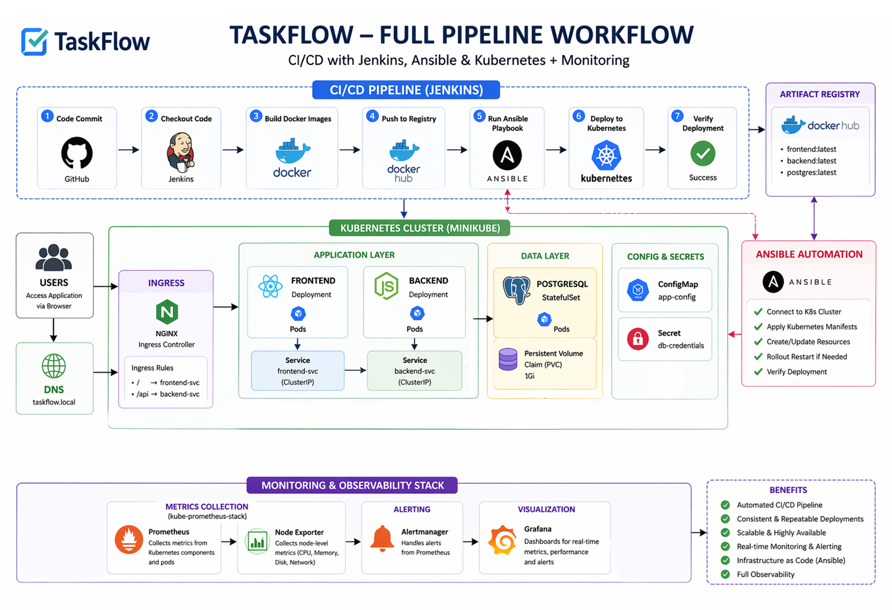

# 📌 End-to-End DevOps CI/CD Pipeline on Kubernetes

## 🚀 Overview

TaskFlow is a full-stack task management application deployed using a complete **DevOps CI/CD pipeline**.  
It demonstrates modern cloud-native practices including:

- Dockerized microservices
- Jenkins CI/CD pipeline
- Ansible automation
- Kubernetes deployment (Minikube)
- Ingress-based routing (NGINX)
- PostgreSQL StatefulSet
- Prometheus + Grafana monitoring
- Load testing & metrics analysis

---

# 🏗️ System Architecture



# 🧱 Tech Stack
## Backend

- Node.js (Express)
- PostgreSQL
- JWT Authentication
- bcrypt password hashing

## Frontend
- React

## DevOps Tools

- Jenkins
- Docker
- Ansible
- Kubernetes (Minikube)
- NGINX Ingress
- Helm (kube-prometheus-stack)
- Prometheus
- Grafana

# 🔄 Deployment Flow

- Developer pushes code to GitHub
- Jenkins triggers pipeline
- Docker images built
- Images pushed to Docker Hub
- Ansible connects to Kubernetes server
- Manifests rendered (Jinja2 templates)
- kubectl apply executed
- App deployed + restarted automatically
- Prometheus scrapes metrics
- Grafana visualizes performance

# 🔁 CI/CD Pipeline
## ⚙️ Jenkins Pipeline Stages


# 📦 Kubernetes Components

| Component  | Type                 |
| ---------- | -------------------- |
| Frontend   | Deployment + Service |
| Backend    | Deployment + Service |
| PostgreSQL | StatefulSet + PVC    |
| Ingress    | NGINX Ingress        |
| Config     | ConfigMap            |
| Secrets    | Kubernetes Secret    |


# 📈 Monitoring Setup

### CPU Usage
```bash
rate(container_cpu_usage_seconds_total{namespace="taskflow-app"}[5m])
```

### Memory Usage
```bash
container_memory_working_set_bytes{namespace="taskflow-app"}
```

### CPU vs Requests
```bash
sum(rate(container_cpu_usage_seconds_total{namespace="taskflow-app"}[5m]))
/
sum(kube_pod_container_resource_requests{namespace="taskflow-app", resource="cpu"})
```

# 🚦 Load Testing

A simple load generator pod was used to simulate traffic:

- 10000+ API requests
- Concurrent requests
- Verified CPU & memory spikes in Grafana


# TaskFlow App


# 🔄 What Happens When Code is Pushed

When a developer pushes code to the repository, the CI/CD pipeline is automatically triggered and executes the following steps:

## 1️⃣ Code Push (GitHub)

- Developer pushes changes to the GitHub repository
- This action triggers a webhook connected to Jenkins using ngrok

## 2️⃣ Jenkins Pipeline Triggered

- Jenkins detects the change and starts the pipeline
- Pipeline runs using the `Jenkinsfile`

## 3️⃣ Build Stage (Docker Images)

- Jenkins builds updated Docker images:
  - `taskflow-frontend`
  - `taskflow-backend`
- Images are tagged (build number)

## 4️⃣ Push to Docker Hub

- Jenkins logs in to Docker Hub using stored credentials
- Built images are pushed to the registry

## 5️⃣ Deployment via Ansible

- Jenkins runs an Ansible playbookand passes build number as an image tag
- Ansible connects to the Kubernetes server via SSH

### Inside the playbook:

- Kubernetes manifests are copied to the server
- Jinja2 templates (`.yml.j2`) are rendered with the new image tag

## 6️⃣ Kubernetes Deployment

- `kubectl apply` is executed  
- Kubernetes detects changes in image version  
- A rolling update is triggered automatically  

### 🔍 What happens internally:
- New pods are created with updated images  
- Old pods are gradually terminated  
- No downtime occurs during deployment  

## 7️⃣ Application Update

- Frontend and backend pods run the new version  
- Kubernetes Services continue routing traffic  
- Ingress routes external traffic seamlessly  

## 8️⃣ Monitoring & Verification

- Prometheus automatically scrapes new metrics  
- Grafana dashboards update in real time  
- Resource usage (CPU, memory, network) is monitored  

## ✅ Final Result

- Application is updated automatically  
- No manual deployment required  
- Zero-downtime rollout achieved  
- Fully observable system  
